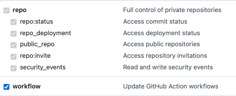

# delete-gh-workflow-runs

[](https://goreportcard.com/report/github.com/christosgalano/delete-gh-workflow-runs)
[](https://pkg.go.dev/github.com/christosgalano/delete-gh-workflow-runs)
[](https://github.com/christosgalano/delete-gh-workflow-runs/releases)

## Table of contents

- [Description](#description)
- [Installation](#installation)
- [Requirements](#requirements)
- [Usage](#usage)
- [Contributing](#contributing)
- [License](#license)

## Description

**delete-gh-workflow-runs** is a command-line tool that deletes GitHub Actions workflow runs based on the provided input.

## Installation

### Homebrew

```bash
brew tap christosgalano/christosgalano
brew install delete-gh-workflow-runs
```

### Go

```bash
go install github.com/christosgalano/delete-gh-workflow-runs/cmd/delete-gh-workflow-runs@latest
```

### Binary

Download the latest binary from the [releases page](https://github.com/christosgalano/delete-gh-workflow-runs/releases/latest).

## Requirements

To run delete-gh-workflow-runs, you must have a GitHub token with the `repo` scope and `workflow` permissions.



## Usage

delete-gh-workflow-runs is a command-line tool that deletes GitHub Actions workflow runs based on the provided input.

**Arguments:**

- `--owner` - The owner of the repository.
- `--repo` - The name of the repository.
- `--workflow` - The name of the workflow or "all" to delete all workflow runs; default is "all".
- `--token` - The GitHub token.

### Example usage

Delete the runs of a specific workflow:

```bash
delete-gh-workflow-runs --owner {owner} --repo {repo} --workflow {workflow} --token {token}
```

Delete all workflow runs of a repository:

```bash
delete-gh-workflow-runs --owner {owner} --repo {repo} --token {token}
```

## Contributing

Information about contributing to this project can be found [here](CONTRIBUTING.md).

## License

This project is licensed under the [MIT License](LICENSE).
